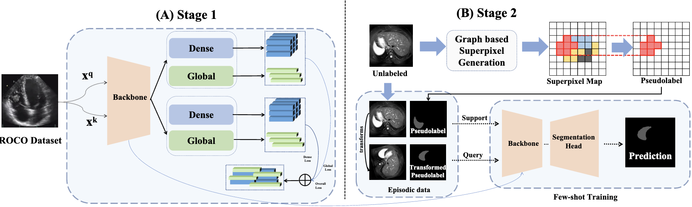
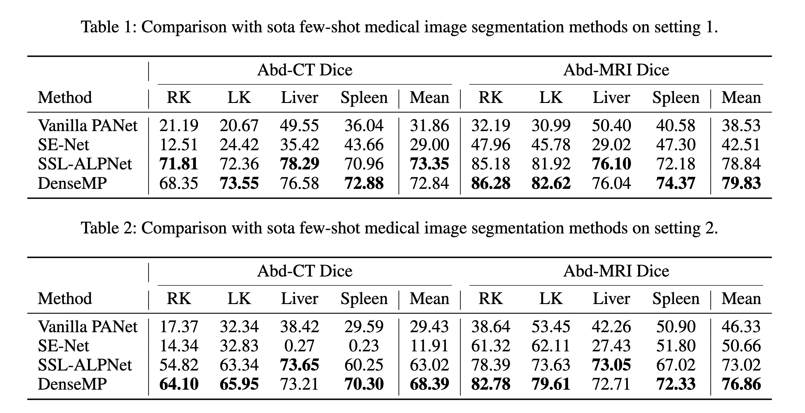
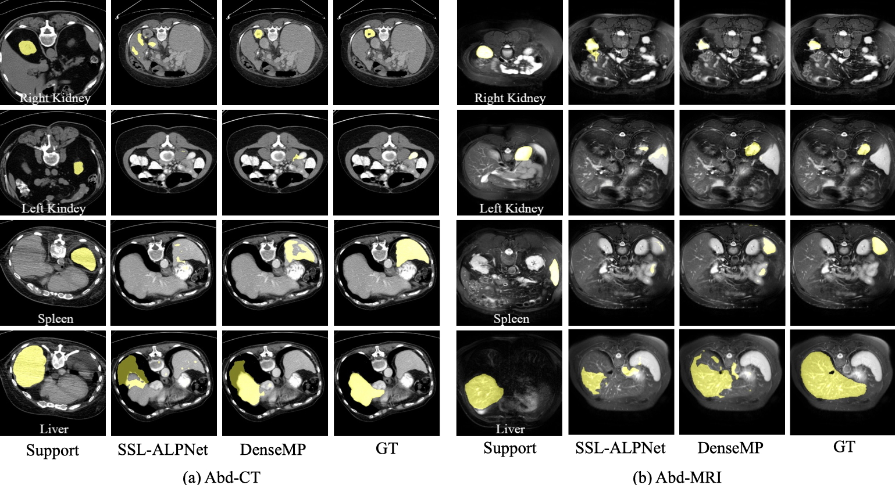

# DenseMP: Unsupervised Dense Pre-training for Few-shot Medical Image Segmentation

Official PyTorch implementation for the paper:

> **DenseMP: Unsupervised Dense Pre-training for Few-shot Medical Image Segmentation**
>
> Zhaoxin Fan, Puquan Pan, Zeren Zhang, Ce Chen, Tianyang Wang, Siyang Zheng, Min Xu
>
> <a href='https://arxiv.org/abs/2307.09604'></a> [](LICENSE)


<p align="center">

</p>

> Few-shot medical image semantic segmentation is of paramount importance in the domain of medical image analysis. However, existing methodologies grapple with the challenge of data scarcity during the training phase, leading to over-fitting. To mitigate this issue, we introduce a novel Unsupervised Dense Few-shot Medical Image Segmentation Model Training Pipeline (DenseMP) that capitalizes on unsupervised dense pre-training. DenseMP is composed of two distinct stages: (1) segmentation-aware dense contrastive pre-training, and (2) few-shot-aware superpixel guided dense pre-training. These stages collaboratively yield a pre-trained initial model specifically designed for few-shot medical image segmentation, which can subsequently be fine-tuned on the target dataset. Our proposed pipeline significantly enhances the performance of the widely recognized few-shot segmentation model, PA-Net, achieving state-of-the-art results on the Abd-CT and Abd-MRI datasets. Code will be released after acceptance.

## &#x1F527; Usage
### Stage 1: Segmentation-aware Dense Contrastive Pre-training
#### Pre-step
1. Create a conda virtual environment and activate it.
```bash
conda create -n open-mmlab python=3.7 -y
conda activate open-mmlab
```

2. Installing
```bash
pip3 install torch torchvision torchaudio --extra-index-url https://download.pytorch.org/whl/cu113
cd DenseCL
pip install -r requirements.txt
python setup.py develop
```

1. (Optinal) Install `google` and `future tensorboard`
```bash
pip install google
pip install future tensorboard
```

#### Datasets

- ROCO: [Radiology Objects in COntext (ROCO)](https://github.com/razorx89/roco-dataset) 
  Here we only use data from `/roco-dataset/data/train/radiology/`. And we implement the data structure as follows
  ```
  Stage1
  ├── openselfsup
  ├── benchmarks
  ├── configs
  ├── data
  │   ├── roco
  │   │   ├── ....jpg
  │   │   ├── ....jpg
  ```


#### Models

- Download the pre-trained backbones from [ResNet101 pretrained by ImageNet](https://cloudstor.aarnet.edu.au/plus/s/4sugyvuBOiMXXnC/download) and put the pth file under `/Stage1/initmodel/`
- Download our trained Stage1 backbone from [gdrive](https://drive.google.com/file/d/1CZnfJNcwpM2kkxs5WTTG36JM575F3PYx/view?usp=sharing) and put them under `Stage2/pretrained_model/densecl/radiology_medical_image/`, for Stage 2 training.


#### Scripts
- `cd ./Stage1`
- **Step 1** *Training*
  Train the shared backbone used in Stage 2 with the following command line.
  `bash tools/dist_train.sh ${CONFIG_FILE} ${GPUS} [optional arguments]`
  Optional arguments are:
  - `--resume_from ${CHECKPOINT_FILE}`: Resume from a previous checkpoint file.
  - `--pretrained ${PRETRAIN_WEIGHTS}`: Load pretrained weights for the backbone.
  - 
- **Step 2** *Extracting Backbone Weights*
  ```bash
  WORK_DIR=work_dirs/selfsup/densecl/densecl_roco_50ep/
  CHECKPOINT=${WORK_DIR}/epoch_50.pth
  WEIGHT_FILE=${WORK_DIR}/extracted_densecl_roco_50ep.pth

  python tools/extract_backbone_weights.py ${CHECKPOINT} ${WEIGHT_FILE}
  ```

### Stage 2: Few-shot-aware Superpixel Guided Dense Pre-training
#### Pre-step: Installing dependencies
```bash
cd ./Stage2
pip install -r requirements.txt
```
#### Datasets
- Abdominal MRI:  [Combined Healthy Abdominal Organ Segmentation dataset](https://chaos.grand-challenge.org/)
- Abdominal CT: [Synapse Multi-atlas Abdominal Segmentation dataset](https://www.synapse.org/#!Synapse:syn3193805/wiki/217789)

For pre-processed data of Abd-MRI and Abd-CT, please download from [gdrive]()

#### Models

- Download the pre-trained backbones of Stage 1 from [gdrive](https://drive.google.com/file/d/1CZnfJNcwpM2kkxs5WTTG36JM575F3PYx/view?usp=sharing) and put them under `Stage2/pretrained_model/densecl/radiology_medical_image/`. 
- We provide trained DenseMP [models](https://drive.google.com/file/d/1NIHEwwDyAtvsRj1ebiG1Up_3_8TJjhvX/view?usp=sharing) for performance evaluation. Please put it under `Stage2/exps`

#### Scripts
The results will be saved in `exps`folder; remember to make sure the target`logs`folder exist, or the logs may not be saved.
- `cd ./Stage2`
- **Step 1** *Training*

  ```bash
  bash examples/mri_ct_s1_l0/02_DenseCL_Medical/train_ssl_abdominal_mri_densecl_5_fold.sh | tee logs/mri_ct_s1_l0/02_DenseCL_Medical_Train_5k_Mix_0
  ```

- **Step 2** *Testing*

  ```
  bash examples/mri_ct_s1_l0/02_DenseCL_Medical/test_ssl_abdominal_mri_densecl_5_fold.sh | tee logs/mri_ct_s1_l0/02_DenseCL_Medical_Test_5k_Mix_0
  ```

- **Step 3** *Finetuning* 
  After obtaining the best model from Step 1&2, remember the modified the `sh`file in order to finetune the model to obtain the best performance.
  ```bash
  bash examples/mri_ct_s1_l0/02_DenseCL_Medical/ft_test_ssl_abdominal_mri_densecl_5_fold.sh | tee logs/mri_ct_s1_l0/02_DenseCL_Medical_Ft_Train_5k_Mix_0
  ```
  after training, we evaluate the performance of the method
  ```bash
  bash examples/mri_ct_s1_l0/02_DenseCL_Medical/ft_test_ssl_abdominal_mri_densecl_5_fold.sh | tee logs/mri_ct_s1_l0/02_DenseCL_Medical_Ft_Test_5k_Mix_0
  ```

#### Performance

Performance comparison with the state-of-the-art approaches (*i.e.*, [SSL-ALPNet](https://github.com/cheng-01037/Self-supervised-Fewshot-Medical-Image-Segmentation) in terms of **average** **Dice** across all folds.)

<p align="middle">
    
</p>


#### Visualization

<p align="middle">
    
</p>


### Supporting Experiments
#### Comparison with SOTA pertaining methods using MMPreTrain
1. **Installation**. For more detailed information, please refer to [MMPreTrain](https://github.com/open-mmlab/mmpretrain)

    quick steps for installation
    ```bash
    conda create -n open-mmlab python=3.8 pytorch==1.10.1 torchvision==0.11.2 cudatoolkit=11.3 -c pytorch -y
    conda activate open-mmlab
    pip install openmim
    git clone https://github.com/open-mmlab/mmpretrain.git
    cd mmpretrain
    mim install -e .
    ```
2. **Scripts** 

    We conducted experiments on the following backbones: Swin-SimMIM, ViT-MAE and Res50-SimCLR
    ```bash
    cd ./Supporting_Experiments/mmpretrain-main/
    GPU=$1
    port=23494
    # config=mae_vit-base-p16_4xb256-amp-coslr-50e_ROCO
    # config=simmim_swin-base-w7_4xb64_50e_ROCO
    # config=simclr_resnet50_4xb64-coslr-50e_ROCO
    config=simclr_resnet101_4xb64-coslr-50e_ROCO
    CUDA_VISIBLE_DEVICES=$GPU PORT=${port} ./tools/dist_train.sh ./projects/my_project/config/${config}.py 4 --work-dir output/${config}
    ```
    after Stage 1 training, we do finetune-training on Stage 2, remember to change the name of `sh` file and `log`destination, results are save in `/exps`
    ```bash
    cd ./Stage2
    bash examples/mri_ct_s1_l0/03_OtherSSL_Medical/ft_train_5k_mix_abdominal_mri_vitmae_5_fold.sh 
    ```
    finetune-testing
    ```bash
    bash examples/mri_ct_s1_l0/03_OtherSSL_Medical/ft_test_5k_mix_abdominal_mri_vitmae_5_fold.sh | tee logs/mri_ct_s1_l0/03_VitMAE_Medical_Ft_Test_5k_MIX_0/
    ```


### References

This repo is mainly built based on [DenseCL](https://github.com/WXinlong/DenseCL), [SSL_ALPNet](https://github.com/cheng-01037/Self-supervised-Fewshot-Medical-Image-Segmentation) and [MMPreTrain](https://github.com/open-mmlab/mmpretrain). Thanks for their great work!


### BibTeX

If you find our work and this repository useful. Please consider giving a star :star: and citation &#x1F4DA;.

```bibtex
@article{fan2023densemp,
  title={DenseMP: Unsupervised Dense Pre-training for Few-shot Medical Image Segmentation},
  author={Fan, Zhaoxin and Pan, Puquan and Zhang, Zeren and Chen, Ce and Wang, Tianyang and Zheng, Siyang and Xu, Min},
  journal={arXiv preprint arXiv:2307.09604},
  year={2023}
}
```
